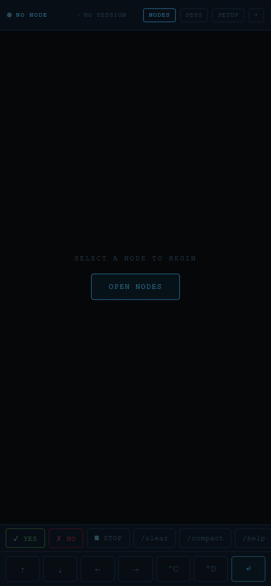

# claudephone

Cliente web para usar Claude Code desde el celular. Corre un servidor en un teléfono con Termux o en una Raspberry Pi, y desde el navegador de cualquier celular o tableta controlas las sesiones por WiFi o Tailscale. Es para quien quiere programar con Claude Code sin estar frente a una computadora.

| Móvil | Panel de configuración de un equipo nuevo |
| --- | --- |
|  |  |

## Qué hace

- Abre sesiones reales con `node-pty` que lanzan `claude` solos. Cada sesión guarda su salida, así que quien se conecta tarde ve lo anterior.
- Permite crear, unirse, redimensionar y cerrar sesiones por eventos de Socket.IO.
- Red de nodos: un solo cliente guarda varios equipos (nombre y URL) y se conecta a cualquiera, por ejemplo un teléfono o una Raspberry Pi.
- Cliente PWA con xterm.js, instalable, con botones rápidos (YES, NO, STOP, flechas, Ctrl+C) pensados para pantalla táctil.
- Ayudas para configurar un equipo nuevo: SSH con código QR y una página con comandos de Termux para copiar con un toque.

## Tecnologías

Node.js, Express, Socket.IO, node-pty, xterm.js, PWA (manifest y service worker), shell scripts.

## Cómo correrlo

`node-pty` se compila al instalar, así que necesitas Node, `python`, `make` y un compilador de C.

```bash
npm install
npm start
```

Abre `http://localhost:3000` o la IP de tu red local. Variables de entorno (ver `.env.example`): `ANTHROPIC_API_KEY` para el `claude` que se lanza y `PORT` (por defecto 3000).

En el teléfono con Termux ejecuta `bash install.sh`, luego `npm start` y abre `http://<ip>:3000`.

## Emparejar un teléfono por QR

1. En la PC, en la misma red WiFi, ejecuta `node serve-qr.js`. Muestra un QR que apunta a `setup-ssh.sh`.
2. Escanéalo con el teléfono y corre el script en Termux. Configura SSH en el puerto 8022 e imprime las IPs.
3. Inicia el servidor en el teléfono y agrega el nodo (nombre y `http://<ip>:3000`) desde la app.

## Estado

Prototipo funcional. Las sesiones viven solo en memoria y no hay autenticación, así que está pensado para una red personal de confianza.
