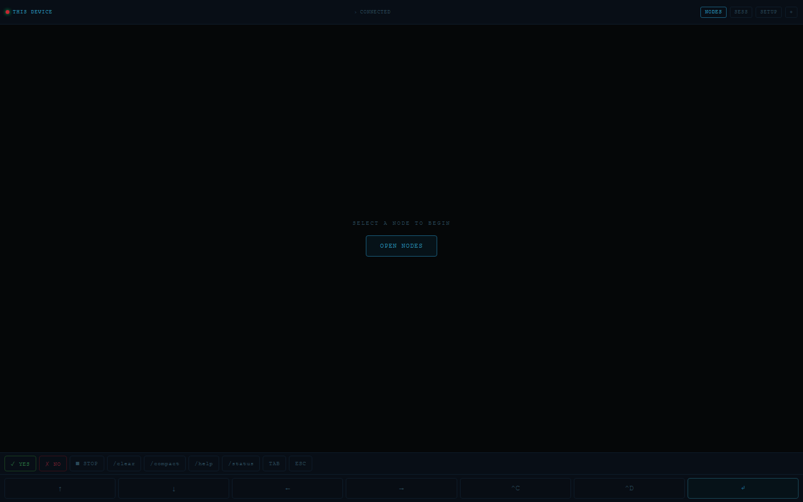

# claude-phone

Mobile-first web client that wraps Claude Code sessions over a PTY — run Claude Code on a phone (Termux) or a Raspberry Pi, and drive it from any phone/tablet browser over LAN or Tailscale.

## What it does

- Spawns real PTY sessions via `node-pty` that auto-launch `claude`, with per-session output buffers, replay for clients that join late, terminal resize, and session create/join/kill via Socket.IO events.
- Multi-node "Claude Network": one PWA client stores nodes (name + URL) in localStorage and connects to any of them — e.g. a Poco X3 Pro phone, a Pi 3, or a second phone.
- PWA client (`public/`) built on xterm.js with a mobile-first dark UI; installable via `manifest.json` + service worker (network-first).
- Device onboarding helpers: QR-based SSH setup and a tap-to-copy page of Termux commands.

## Architecture

| File | Role |
| --- | --- |
| `server.js` | Express + Socket.IO + node-pty. Sessions map, events `new_session` / `join` / `input` / `resize` / `kill`; writes `claude` to the PTY 600 ms after spawn. Listens on `0.0.0.0:3000` (`PORT` env). |
| `public/` | PWA client: `index.html` (xterm.js + socket.io-client from CDN, node list in localStorage, SETUP panel with tap-to-copy commands), `manifest.json`, `sw.js`. |
| `install.sh` | Termux (Android) setup: packages, clone, `npm install`, save `ANTHROPIC_API_KEY` to `~/.bashrc`, Termux:Boot autostart. |
| `setup-ssh.sh` | Termux SSH setup: installs openssh, starts `sshd` on port 8022, prints `SSH_USER` / `SSH_PORT` / IPs to paste to Claude, autostarts SSH on boot. |
| `serve-qr.js` | Windows helper: serves `setup-ssh.sh` on port 9998 with a QR code the phone scans. |
| `serve-cmd.js` | Serves a tap-to-copy page of Termux commands on port 9997 with QR. |

## Install and run

Server side (any node; `node-pty` compiles natively, so Node, `python`, `make` and `clang` must be present):

```bash
npm install
npm start            # → http://localhost:3000  (and on the LAN IP)
```

Environment variables (see `.env.example`): `ANTHROPIC_API_KEY` (picked up by the spawned `claude`), `PORT` (default 3000).

**On the phone (Termux):** run `bash install.sh`, then `npm start` and open `http://<ip>:3000`. For SSH access from the PC: run `bash setup-ssh.sh` and paste the printed connection info to Claude.

## QR pairing flow

1. On the PC (same WiFi): `node serve-qr.js` — prints a QR code pointing to the hosted `setup-ssh.sh`.
2. Scan it with the phone camera → open in Termux browser, or in Termux run `curl <url> | bash` — this sets up SSH (port 8022) and prints the IPs and credentials.
3. Paste the `SSH_USER` / `SSH_PORT` / IP values to Claude on the PC so it can reach the phone.
4. Start the server on the phone and open the PWA: add the node (name + `http://<ip>:3000`) and connect. Repeat per node to build the network.

## Project structure

```
claude-phone/
├── server.js · serve-qr.js · serve-cmd.js
├── install.sh · setup-ssh.sh
├── public/                 # PWA client (index.html, manifest.json, sw.js)
├── .env.example
└── package.json            # express (^4.18.2), socket.io, node-pty, qrcode-terminal
```

## Status

Working v1 prototype over LAN or Tailscale mesh. Sessions live in memory only (no persistence, no auth); intended for a personal trusted network.
## Screenshots



